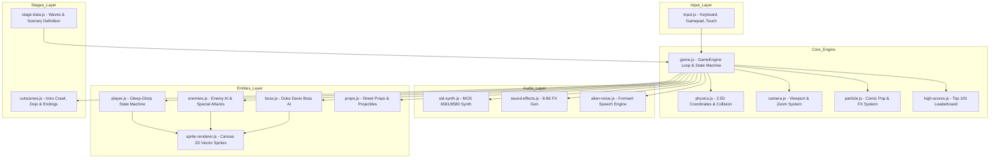

# TNT ALIEN RUMBLE - Comprehensive Technical Documentation (v1.0)

This document provides a deep architectural and implementation breakdown of **TNT Alien Rumble: The Vengeance of Gleep-Glorp**, engineered as an authentic web-based homage to Melbourne House / Beam Software's 1987 Commodore 64 classic *Bop'n Rumble* (*Street Hassle* / *Bad Street Brawler*).

---

## 1. System Overview & Architecture

The application is structured into decoupled, modular systems communicating through a centralized `GameEngine` orchestrator:



---

## 2. 2.5D Coordinate System & Spatial Math

The game engine operates on a pseudo-3D coordinate framework $(X, Y, Z)$:

1. **$X$-Axis (Horizontal Walkway)**:
   - Primary traversal axis representing left-to-right movement along the city street.
   - Constrained within stage boundaries ($0 \le x \le \text{stageLength}$), or toroidally wrapped during infinite Dojo roaming.
2. **$Y$-Axis (Ground Depth / Walkway Lanes)**:
   - Represents sidewalk depth ($330 \le y \le 490$).
   - Determines rendering draw order (entities with higher $Y$ are rendered in front of entities with lower $Y$).
   - Collision detection enforces a depth threshold ($\Delta y \le 28\text{px}$) to ensure hits only connect within the same sidewalk lane.
3. **$Z$-Axis (Vertical Altitude / Jump Height)**:
   - Represents upward displacement from the pavement ($z \ge 0$).
   - Subject to downward gravitational acceleration ($g = 0.55\text{px/frame}^2$).
   - Entities with $z > 0$ cast projected elliptical ground shadows on the sidewalk at $(x, y)$.

### Ground Shadow Equation
$$\text{shadowWidth} = \text{baseWidth} \times \max\left(0.35, 1.0 - \frac{z}{120}\right)$$
$$\text{shadowAlpha} = \max\left(0.15, 0.45 - \frac{z}{200}\right)$$

### Flight & Altitude Exemption
Entities in flight mode (such as Handbag Granny's helicopter ascent) set `isFlying = true` or enter state `helicopter`. This bypasses gravity calculation ($v_z = 0$) and street $Y$-boundary clamping, allowing free vertical ascent off-screen.

---

## 3. Player Entity & Moveset Matrix

The player entity (`Player` in `js/entities/player.js`) implements a hierarchical finite state machine with recovery frames, active hitboxes, and momentum preservation:

| State / Move | Key Input | DMG | Active Frames | Knockback ($v_x, v_z$) | Tactical Properties |
| :--- | :--- | :---: | :---: | :---: | :--- |
| `punch` | `J` | 15 | Frames 3–9 | $(2.5, 0)$ | Fast straight jab; cancels enemy windups. |
| `headbutt` | `K` / `→ + J` | 20 | Frames 4–12 | $(5.0, 1.5)$ | Stretchy head bop with high forward reach. |
| `trip` | `L` / `↓ + J` | 14 | Frames 2–10 | $(2.0, 0)$ | Low shin sweep; dodges flying projectiles. |
| `ram` | `U` / `→, →` | 24 | Continuous | $(6.0, 2.5)$ | Bulldozer head-first charge; armored against basic jabs. |
| `ear_twist` | `I` | 18 | Frames 4–14 | $(1.0, 0)$ | Close-quarters cheek/ear grab; inflicts 2s daze. |
| `belly_flop` | `W + J + ↓` | 26 | Landing | $(4.0, 3.0)$ | Aerial body splash; creates ground shockwave on impact. |
| `dropkick` | `W + K + →` | 22 | Air/Descent | $(6.5, 3.5)$ | Flying boots forward; clears obstacles & dogs. |
| `elbow` | `W + J + ↑` | 20 | Air/Descent | $(4.5, 2.0)$ | Downward diving elbow strike. |
| `donkey_kick` | `O` / `← + J` | 18 | Frames 3–11 | $(-5.5, 2.0)$ | Rear heel mule kick; strikes attackers from behind. |
| `taunt` | `T` | 0 | 30 frames | $(0, 0)$ | Alien hip wiggle; confuses nearby opponents. |
| `super_ufo` | `Space` | 75 | Screen-wide | $(0, 8.0)$ | Abducts and zaps all active enemies simultaneously. |

---

## 4. Enemy AI & Specialized Combat Archetypes

Enemy entities (`Enemy` in `js/entities/enemies.js`) feature adaptive tactical AI operating through distance checks, state timers, and signature behaviors:

### 1. Mohawk Street Punk (`punk`)
- **Behaviors**: Rapid sidewalk pacing, aggressive knife lunges, and flying jump kicks when $80 \le \Delta x \le 160$.
- **Death**: Collapses horizontally onto leather jacket with sunglasses askew; dissolves into red pixel sparks after 5s.

### 2. Handbag Granny Agnes (`granny`)
- **Behaviors**:
  - *Melee Range ($\Delta x \le 55$)*: Heavy overhead leather purse smash.
  - *Mid-Range ($80 \le \Delta x \le 220$)*: Ranged purse throw hurling a spinning handbag projectile across the street.
  - *Helicopter Escape (`state = 'helicopter'`)*: When dodged $\ge 2$ times or at low HP, Agnes grips the handbag vertically, spins the straps like helicopter blades with a rhythmic cartoon rotor flutter, and ascends into the clouds.
- **Death**: Collapses flat on back with floral dress splayed and curlers rolling off; dissolves into pink floral sparkle dust after 5s.

### 3. Barnaby the Attack Poodle (`dog`)
- **Behaviors**: Low-altitude sprint and snapping mid-air ankle leap.
- **Death**: Flattens out on belly with paws splayed; dissolves into fluffy bubble clouds after 5s.

### 4. Hoopster Basketballer (`basketballer`)
- **Visuals**: Towering 84px height (2X scale) with gangly limbs and #23 jersey.
- **Behaviors**:
  - Active pavement dribbling walk cycle.
  - *Bouncing Basketball Projectile*: Launches an orange basketball that bounces with elastic 2.5D gravity across the sidewalk.
  - *Close Range*: Towering two-handed overhand slam.
- **Death**: Falls flat on back with extra-long legs stretched out; dissolves into rubber bounce bursts after 5s.

### 5. Brutus the Bouncer (`bouncer`)
- **Visuals**: Muscular brawler in blue/black checkered flannel shirt with sunglasses.
- **Behaviors**:
  - *Bulldozer Charge Tackle (`charge_tackle`)*: Charges forward at $v_x = 4.8\text{px/frame}$ bowling over everything in his lane with `"BULLDOZED!"` and heavy screen shake.
  - *Overhead Hammer Smash*: Double-fist asphalt slam with dust shockwaves.
- **Death**: Massive face-down sprawl; dissolves into heavy brick rubble dust after 5s.

### 6. Duke Davis (Final Boss - `boss.js`)
- **Phase 1**: Quick boxing combinations, roundhouse kicks, and dragon jump kicks.
- **Phase 2 (Enraged @ $\text{HP} \le 50\%$)**: Red aura pulse, increased speed ($+40\%$), suplex grabs, and comic dialogue taunts (*"I'M GONNA BOP YA!"*).

---

## 5. High Scores & Leaderboard Engine (`high-scores.js`)

The high score subsystem persists the **Top 100** player records in browser `localStorage`:

- **Storage Key**: `tnt_high_scores_top100_v1`
- **Default Seed**: Rank 1 is seeded at **50,000 pts**, with each subsequent rank decrementing by **500 pts** down to Rank 100 at **500 pts**.
- **Stage Cleared Tracking**: Records the exact stage reached/cleared (`STAGE 1`, `STAGE 2`, `STAGE 3`, or `VICTORY`).
- **6-Character Alias**: Enforces retro 6-character uppercase names (`maxlength="6"`).
- **Public API**:
  ```javascript
  window.highScores.getTopScore();               // Returns highest score integer
  window.highScores.isHighScore(score);          // Returns boolean if score qualifies for Top 100
  window.highScores.addScore(name, score, stage);// Inserts record, sorts descending, trims to 100, returns rank (1-100)
  window.highScores.resetToDefaults();           // Resets to initial 50k seed
  ```

---

## 6. Procedural Audio Synthesis Subsystems

### 1. MOS 6581/8580 SID Chip Synth (`sid-synth.js`)
- **Oscillator Channels**:
  - *Voice 1 (Lead)*: Pulse Wave with dynamic Pulse-Width Modulation (PWM) from 10% to 90% via LFO.
  - *Voice 2 (Arpeggio/Chords)*: 50Hz high-speed pseudo-polyphonic arpeggio cycling triad chord intervals.
  - *Voice 3 (Bass & Drums)*: Resonant 2-pole lowpass-filtered saw bass paired with LFSR white/pink noise bursts for snare and hi-hat synthesis.
- **Volume Bus Architecture**: Dedicated sub-gain nodes for Master, Music, SFX, and Voice, loaded on startup from `localStorage`.

### 2. Formant Speech Engine (`alien-voice.js`)
Synthesizes speech in real-time without audio samples by routing a glottal impulse saw-wave through parallel bandpass filters matching human vowel formants ($F_1, F_2, F_3$):
- */a/ (800Hz, 1200Hz, 2500Hz)*
- */e/ (400Hz, 2000Hz, 2800Hz)*
- */i/ (300Hz, 2500Hz, 3200Hz)*
- */o/ (500Hz, 900Hz, 2400Hz)*
- */u/ (350Hz, 800Hz, 2200Hz)*

---

## 7. Version 2.0 Extension Architecture

When planning future enhancements for v2.0, the codebase provides clear extension hooks:


1. **2-Player Co-Op Integration**:
   - `Player` class can be instantiated as `this.player2 = new Player(80, 440, 'zorblax')` with distinct green alien sprites, tentacle whip mechanics, and secondary gamepad/keymap bindings.
2. **Throwable Weapon Subsystem**:
   - Extend `StreetProp` to support `isCarriable: true`. When player presses `J` near a prop, attach to player grip, enabling projectile launching with $v_x = 9.0\text{px/frame}$.
3. **WebGL CRT Shader Pipeline**:
   - Wrap canvas rendering with a WebGL quad rendering a custom CRT fragment shader supporting barrel distortion, shadow mask dots, and phosphor decay persistence.
