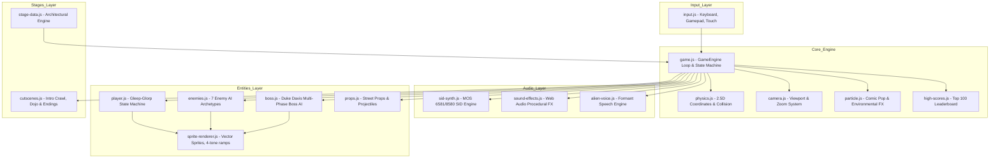
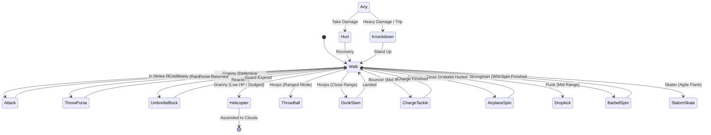

# TNT ALIEN RUMBLE - Comprehensive Technical Documentation (v3.0)

This document provides a deep architectural and implementation breakdown of **TNT Alien Rumble: The Vengeance of Gleep-Glorp (v3.0)**, engineered as a browser-based beat 'em up inspired by Beam Software / Melbourne House's 1987 **Commodore 64** classic *Bop'n Rumble* (*Street Hassle* in Europe, *Bad Street Brawler* on the NES). It is an homage rather than an emulation: the renderer uses a 45-colour palette organised as nine four-tone material ramps, deliberately wider than the C64's fixed VIC-II 16.

---

## 1. System Overview & Architecture

The application is structured into decoupled, modular systems communicating through a centralized `GameEngine` orchestrator:

---

## 2. 2.5D Coordinate System & Spatial Math

The game engine operates on a pseudo-3D coordinate framework $(X, Y, Z)$:

1. **$X$-Axis (Horizontal Walkway)**:
   - Primary traversal axis representing left-to-right movement along the city street.
   - Constrained within stage boundaries ($0 \le x \le \text{stageLength}$), or toroidally wrapped during infinite Dojo roaming.
2. **$Y$-Axis (Ground Depth / Walkway Lanes)**:
   - Represents sidewalk depth ($330 \le y \le 490$).
   - Determines rendering draw order (entities with higher $Y$ are rendered in front of entities with lower $Y$).
   - Collision detection enforces a depth threshold ($\Delta y \le 28\text{px}$) to ensure hits only connect within the same sidewalk lane.
3. **$Z$-Axis (Vertical Altitude / Jump Height)**:
   - Represents upward displacement from the pavement ($z \ge 0$).
   - Subject to downward gravitational acceleration ($g = 0.55\text{px/frame}^2$).
   - Entities with $z > 0$ cast projected elliptical ground shadows on the sidewalk at $(x, y)$.

### Ground Shadow Equation
$$\text{shadowWidth} = \text{baseWidth} \times \max\left(0.35, 1.0 - \frac{z}{120}\right)$$
$$\text{shadowAlpha} = \max\left(0.15, 0.45 - \frac{z}{200}\right)$$

### Flight & Altitude Exemption
Entities in flight mode (such as Handbag Granny's helicopter ascent) set `isFlying = true` or enter state `helicopter`. This bypasses gravity calculation ($v_z = 0$) and street $Y$-boundary clamping, allowing free vertical ascent off-screen.

---

## 3. Graphics Pipeline & Palette Architecture

The sprite renderer (`SpriteRenderer` in `js/entities/sprite-renderer.js`) implements a chunky four-tone shading pipeline in the spirit of the C64 original. The palette (`this.pal`) holds **48 named entries resolving to 45 distinct colours** — nine material families of highlight/mid/shadow/deep, plus metal at three steps and nine singletons. This is wider than the VIC-II's 16 by choice; see the fidelity note in the README.

### Shading Ramps
* **Alien Bio-Plasma**: `#e4edf2` (highlight) $\to$ `#b2c2cc` (midtone) $\to$ `#7d919e` (shadow) $\to$ `#4c5d6a` (dark outline) with glowing `#39ff14` neural veins and `#00f0ff` plasma meter.
* **Human Skin Tones (Caucasian / Duke / Granny / Punk / Bouncer)**: `#ffe2cf` $\to$ `#f2b58d` $\to$ `#c47a4d` $\to$ `#7a3e20`.
* **Bronze Skin Tones (Hoops #23)**: `#c68d63` $\to$ `#8e542e` $\to$ `#5c3116` $\to$ `#331607`.
* **Denim Blue**: `#8cb2ff` $\to$ `#4b75d6` $\to$ `#264599` $\to$ `#101e4a`.
* **Leather Black & Steel**: `#686b7e` $\to$ `#383b4b` $\to$ `#1e202d` $\to$ `#0c0d14` with `#ffffff` specular glints.
* **Gold & Warm Yellow**: `#fff480` $\to$ `#f5c200` $\to$ `#b38000` $\to$ `#5c3d00`.

---

## 4. Building Facade & Environmental Architecture Engine

Implemented in `StageRenderer` (`js/stages/stage-data.js`), the architectural renderer proceduralizes multi-layered city environments:

1. **Raster Sky Gradient Bars** (the C64 raster-interrupt trick): Smooth vertical linear gradients calculating multi-stop sky colors transitioning from deep twilight indigo to fiery sunset amber.
2. **Parallax Far Skyline**: Distant skyscrapers with illuminated window grids and blinking red aircraft warning lights ($x \cdot 0.15$ parallax velocity).
3. **Running-Bond Brickwork**: Procedural individual brick mortar grid ($16 \times 8\text{px}$ staggered blocks) with dark mortar lines, chipped masonry, and base grime weathering.
4. **Architectural Cornices**: Multi-tiered Victorian stone cornices with dentil blocks and cast drop shadows.
5. **Deluxe Windows**: Beveled frames, stone sills with drop-shadows, half-drawn venetian/floral blinds, and warm interior silhouettes (lamps, plants).
6. **Wrought-Iron Fire Escapes**: Multi-story zigzag stairs, landing gratings, safety railings, and wall-cast drop shadows.
7. **Window Air Conditioners**: Metallic cooling louvers and periodic condensed water droplets that plink on the sidewalk.
8. **3D Storefront Awnings**: Scalloped fabric edges, alternating colored striped canvas with realistic lighting and shadow.
9. **Glowing Neon Channel Signs**: Outer neon tube buzz and glow with backing channel mounts.
10. **Atmospheric Street Elements**: Cast-iron sewer grates with rising steam plumes, waffle-pattern manholes, and Victorian street lamps with warm radial light cones pooling on the pavement.

---

## 5. Player Entity & Moveset Matrix

The player entity (`Player` in `js/entities/player.js`) implements a hierarchical finite state machine with recovery frames, active hitboxes, and momentum preservation:

| State / Move | Key Input | DMG | Active Frames | Knockback ($v_x, v_z$) | Tactical Properties |
| :--- | :--- | :---: | :---: | :---: | :--- |
| `jab` | `J` | 12 | Frames 3–9 | $(3.0, 0)$ | Fast straight jab; cancels enemy windups. |
| `headbutt` | `K` / `→ + J` | 22 | Frames 4–12 | $(8.0, 1.5)$ | Stretchy head bop with high forward reach. |
| `trip` | `L` / `↓ + J` | 14 | Frames 2–10 | $(2.0, 0)$ | Low shin sweep; dodges flying projectiles. |
| `bulldozer` | `U` / `→, →` | 28 | Continuous | $(12.0, 3.5)$ | Bulldozer head-first charge; armored against basic jabs. |
| `ear_twist` | `I` | 26 | Frames 4–14 | $(4.0, 0)$ | Close-quarters cheek/ear grab; inflicts 2s daze. |
| `belly_flop` | `W + J + ↓` | 32 | Airborne | $(10.0, 2.0)$ | Heavy aerial body splash; ground dust shockwave. |
| `roundhouse` | `W + K + →` | 25 | Airborne | $(10.0, 2.5)$ | Horizontal flying dropkick with forward momentum. |
| `macho_elbow`| `W + J + ↑` | 30 | Airborne | $(8.0, 2.0)$ | Descending elbow smash from space turnbuckle. |
| `donkey_kick`| `O` / `← + J` | 20 | Frames 3–10 | $(7.0, 0)$ | Backward mule kick punishing flankers. |
| `taunt` | `T` | 0 | Continuous | $(0, 0)$ | Wiggles hips & antennae; builds Cosmic Rage. |
| `super` | `Space` | 75 | Full Screen | $(0, 8.0)$ | Screen-wide UFO abduction & electrical zap. |

---

## 6. Enemy AI State Machines & Archetypes

Implemented in `Enemy` (`js/entities/enemies.js`):

---

## 7. Web Audio Synthesis Architecture

All audio is generated entirely in code using the Web Audio API:

1. **MOS 6581/8580 SID Engine (`sid-synth.js`)**:
   - Multi-channel chiptune synthesizer with Pulse-Width Modulation (PWM), 50Hz arpeggiator, resonant low-pass filter sweeps, and LFSR pseudo-random noise drums.
   - 5 full multi-channel tracks: *Title Theme*, *Downtown Urban Beat*, *Park & Courts*, *Duke Davis Showdown*, and *Cosmic Victory Fanfare*.
2. **Alien Formant Speech Synthesizer (`alien-voice.js`)**:
   - Formant filter bank with dual bandpass resonators reproducing authentic 1980s robotic alien speech.
3. **Procedural Sound Effects (`sound-effects.js`)**:
   - Real-time synthesis for punches, springy bops, whooshes, roller-skate whirs, heavy iron barbell clangs, umbrella shield deflection clatters, dog latch bites, and A/C water droplet plinks.

---

## 8. High Score System & Persistence

- **Storage Key**: `localStorage['tnt_high_scores_top100_v1']`
- **Default Seed**: Rank 1 begins at **50,000 points**, decrementing by **500 points** down to 500 points for Rank 100.
- **Leaderboard Modal**: Interactive Hall of Fame with tabs for **`[TOP 10]`**, **`[TOP 50]`**, and **`[ALL 100]`**, podium icons, and live highlight animation on new record entry.
